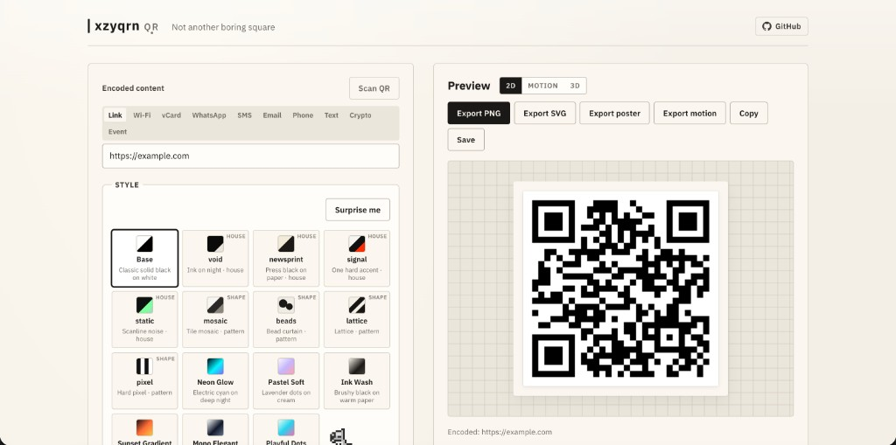

# xzyqrn qr

Not another boring square. Design a QR code in the browser, then export it.

Vite, TypeScript, [qr-code-styling](https://www.npmjs.com/package/qr-code-styling), [Three.js](https://threejs.org), [gifenc](https://www.npmjs.com/package/gifenc), and [jsQR](https://www.npmjs.com/package/jsqr). No backend.

## How to use

### Encoded content

Pick what the code should hold: a link, Wi-Fi network, vCard, WhatsApp, SMS, email, phone number, plain text, a crypto address, or a calendar event.

Fill in the fields, or click Scan QR and point a camera at an existing code. You can also upload a photo.

### Style

Click a preset, or Surprise me (the `S` key does the same). House styles change colors and shapes. Shape presets (mosaic, beads, lattice, pixel) only change the dots; your color pickers stay as they are.

Further down the page you can pick a kit (used on poster export), a frame, colors, a transparent background, and an optional center logo.

### Preview

- **2D** is the still design.
- **Motion** plays the looping pulse and sheen. Export motion saves that loop as a GIF.
- **3D** extrudes the code so you can orbit it.

### Export

PNG, SVG, a square poster (uses the selected kit), or a motion GIF. Copy puts the current 2D image on the clipboard. Save stores the design in a library on this device.

## Tips

Keep the encoded text short when you can. Long payloads make denser codes that are harder to scan.

If you load a logo from a URL, that host has to allow CORS or canvas export will fail. Uploading a file avoids that.

Test-scan before you print or share. Error correction defaults to H (~30%).

## License

[MIT](LICENSE)
